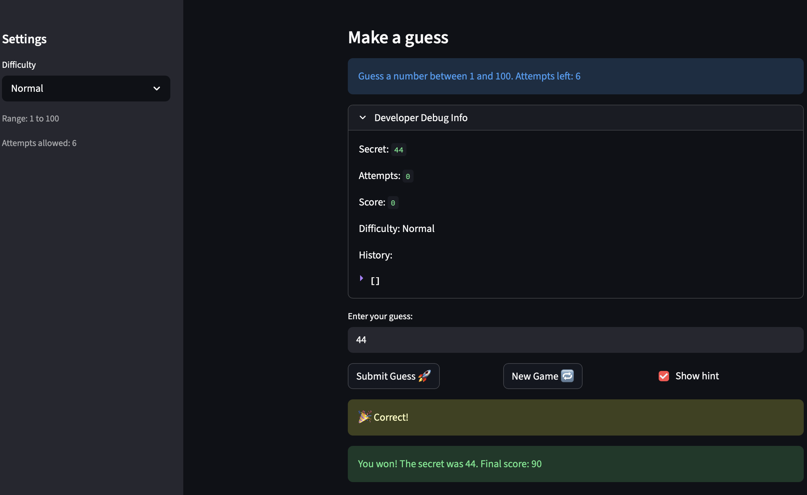
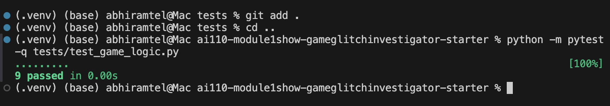

# 🎮 Game Glitch Investigator: The Impossible Guesser

## 🚨 The Situation

You asked an AI to build a simple "Number Guessing Game" using Streamlit.
It wrote the code, ran away, and now the game is unplayable. 

- You can't win.
- The hints lie to you.
- The secret number seems to have commitment issues.

## 🛠️ Setup

1. Install dependencies: `pip install -r requirements.txt`
2. Run the broken app: `python -m streamlit run app.py`

## 🕵️‍♂️ Your Mission

1. **Play the game.** Open the "Developer Debug Info" tab in the app to see the secret number. Try to win.
2. **Find the State Bug.** Why does the secret number change every time you click "Submit"? Ask ChatGPT: *"How do I keep a variable from resetting in Streamlit when I click a button?"*
3. **Fix the Logic.** The hints ("Higher/Lower") are wrong. Fix them.
4. **Refactor & Test.** - Move the logic into `logic_utils.py`.
   - Run `pytest` in your terminal.
   - Keep fixing until all tests pass!

## 📝 Document Your Experience

- [x] Describe the game's purpose.
- [x] Detail which bugs you found.
- [x] Explain what fixes you applied.

### Game Purpose
This app is a Streamlit number-guessing game where the user picks a difficulty, enters guesses, and gets higher/lower hints until they win or run out of attempts. The goal of this lab was to debug AI-generated code and make the game stable, fair, and testable.

### Bugs Found
- Easy mode could produce out-of-range secrets after reset (for example, > 20).
- New Game did not fully reset all game state.
- Attempt counting was inconsistent and could feel off.
- Hint messages were reversed for high/low guesses.
- Hard difficulty was easier than Normal.
- A Streamlit session-state update bug caused a runtime exception when resetting the input key after widget creation.

### Fixes Applied
- Moved game logic into `logic_utils.py` to make behavior easier to test.
- Fixed difficulty ranges and made Hard harder than Normal.
- Corrected high/low hint logic.
- Standardized attempt handling and reset behavior.
- Updated reset flow to safely clear input using a pre-widget flag, avoiding Streamlit key mutation errors.
- Added and updated pytest coverage for game logic and edge cases.

## 📸 Demo

- [x] Add screenshot of fixed winning game at `images/demo-winning-game.png`.

### Challenge 1: Advanced Edge-Case Testing
If you completed Challenge 1, include your test run screenshot below.

- [x] Add pytest screenshot at `images/pytest-passing.png`.

Latest automated result in this repo: `9 passed`.

## 🚀 Stretch Features

- [ ] [If you choose to complete Challenge 4, insert a screenshot of your Enhanced Game UI here]
